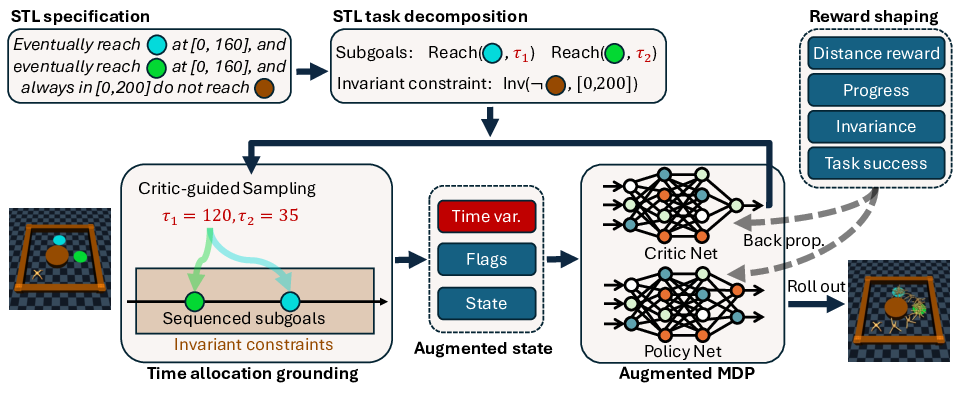
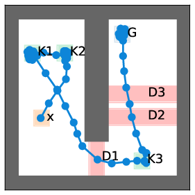
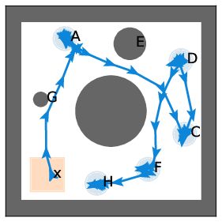
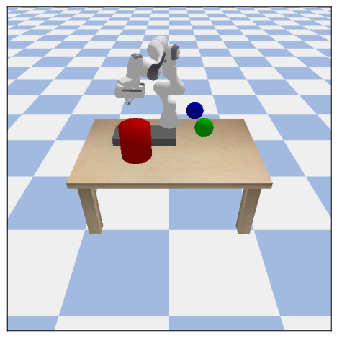
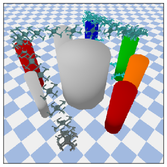
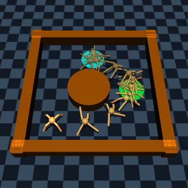
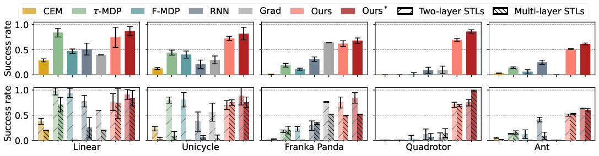
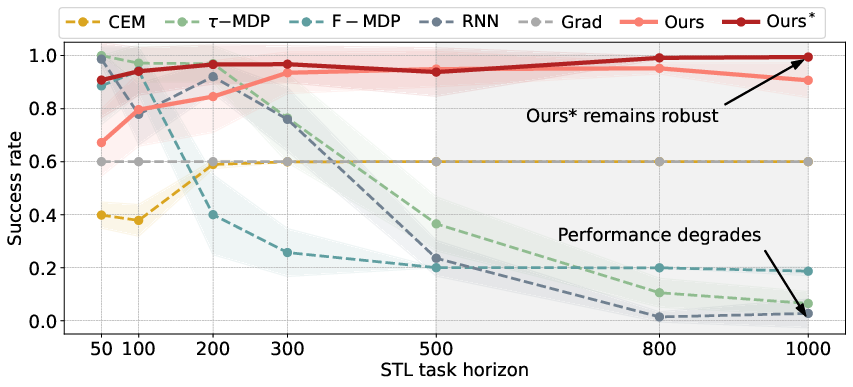
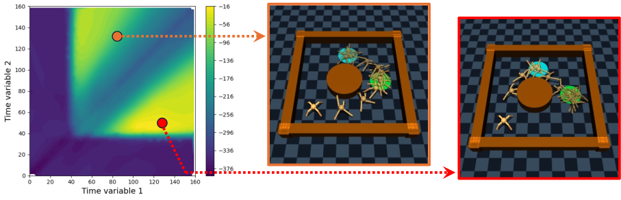

# TGPO: Temporal Grounded Policy Optimization for Signal Temporal Logic

[<ins>Yue Meng</ins>](https://mengyuest.github.io/), [<ins>Fei Chen</ins>](https://scholar.google.com/citations?user=sq0N9XUAAAAJ&hl=en), and [<ins>Chuchu Fan</ins>](https://chuchu.mit.edu/)

[<ins>Reliable Autonomous Systems Lab @ MIT (REALM)</ins>](https://aeroastro.mit.edu/realm/)

> A hierarchical reinforcement learning (RL) framework to solve general Signal Temporal Logic (STL) tasks for complex systems and nested STLs.

<em>Hierarchical RL framework based on STL decomposition.</em>

<table>
  <tr>
    <td style="width: 20%; text-align: center;"></td>
    <td style="width: 20%; text-align: center;"></td>
    <td style="width: 20%; text-align: center;"></td>
    <td style="width: 20%; text-align: center;"></td>
    <td style="width: 20%; text-align: center;"></td>
  </tr>
  <tr>
    <td style="width: 20%; text-align: center;">Linear</td>
    <td style="width: 20%; text-align: center;">Nonlinear</td>
    <td style="width: 20%; text-align: center;">Franka Panda</td>
    <td style="width: 20%; text-align: center;">Quadrotor</td>
    <td style="width: 20%; text-align: center;">Ant</td>
  </tr>
</table>

<em>TGPO solves for a wide range of task environments.</em>

<em>Strong results in STL success rate especially on complex environments.</em>

<em>Our result performance stay robust over long-horizon.</em>

<em>Our method can generate interpretable heatmaps and multi-modal behaviors.</em>

## Code and details coming soon